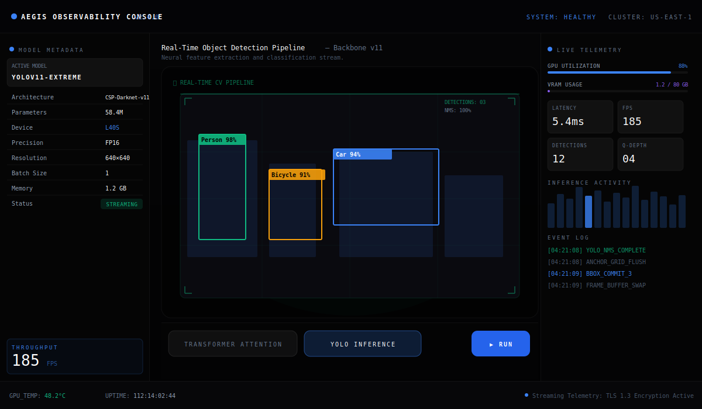

# Day 1 — Introduction to Agents & Vibe Coding

> **5-Day AI Agents: Intensive Vibe Coding Course With Google × Kaggle**

---

## ✅ What I Did Today

### 🎙️ Listened — Unit 1 Summary Podcast
*"Introduction to Agents & Vibe Coding"*  
→ [Watch on YouTube](https://www.youtube.com/watch?v=cbzmr7vt4XA?utm_medium%3Demail&utm_source=gamma&utm_campaign=learn-intensive-assignment1-june-2026)

### 📄 Read — Whitepaper: The New SDLC with Vibe Coding
*Agentic engineering, intent-driven development, and the evolving role of developers.*  
→ [Read the Whitepaper on Kaggle](https://www.kaggle.com/whitepaper-the-new-SDLC-with-vibe-coding?utm_medium=email&utm_source=gamma&utm_campaign=learn-intensive-assignment1-june-2026)

### 🛠️ Hands-On Codelabs Completed
- **Get started with Antigravity 2.0 and IDE** — Explored the Antigravity IDE, CLI, MCP Servers, Artifacts, and Slash Commands
- **Build a Web Application in AI Studio and Deploy to Cloud Run** — Built and deployed a full frontend app from AI Studio → Google Cloud Run (serverless, live!)

### 🌐 Built & Deployed
A full interactive frontend app, built in Google AI Studio and deployed to **Google Cloud Run** (serverless).

---

## ⚡ What I Built — AI Observability Console

A dark-themed AI inference visualization prototype dashboard — not a toy, a fully interactive UI deployed and running on the cloud.

### Features
- **Multi-Head Attention Visualization** — Real-time weight activation across transformer layers (GPT-NeoX-7B, 32 heads, Layer 24)
- **YOLO v11 Object Detection Pipeline** — Bounding boxes and classification confidence scores (Person 98%, Car 94%, Bicycle 91%)
- **Live Telemetry Panel** — GPU utilization, VRAM usage, latency, FPS, entropy metrics
- **Sentiment Inference Results** — NLP run outputs displayed live
- **Two switchable modes** — Transformer Attention mode and YOLO Inference mode with animated stage-by-stage pipeline walkthroughs

### Screenshots

| Transformer Attention Mode | YOLO Inference Mode |
|---|---|
|  |  |

---

## 💡 Key Insight That Hit Hardest

> *"The majority of mistakes in AI-assisted development aren't made by the models — they're made by us. Poor context, vague prompts, not thinking in systems."*

Building this dashboard hammered that home. The moment I gave the agent **precise intent and structure**, everything snapped into place.

The whitepaper frames the shift beautifully — developers are no longer just coders, we're becoming **system orchestrators**: designing the evaluation, constraint, and context harnesses that allow AI agents to operate safely and effectively. That mental model alone is worth the course.

---

## 🧠 Key Learnings

### 1. Vibe Coding is intent-driven development
You don't write code line by line — you describe outcomes, constraints, and system structure. The agent fills the gaps. The quality of your output is directly proportional to the quality of your context.

### 2. Antigravity 2.0 is a full agentic IDE
- **MCP Servers** — Model Context Protocol lets agents connect to live tools and data sources
- **Artifacts** — Agents can produce versioned, deployable outputs (not just text)
- **Slash Commands** — Structured prompting primitives that give the agent precise intent

### 3. AI Studio → Cloud Run is a one-command deploy
Google AI Studio scaffolds a production-ready Vite + React app with an Express server wrapper. `gcloud run deploy` pushes it live in under 2 minutes, serverless, with zero infrastructure management.

### 4. The new SDLC loop
```
Intent → Agent → Artifact → Evaluate → Refine
```
Traditional: write → test → debug  
Agentic: describe → generate → evaluate → constrain → redeploy

### 5. Context is the new code
Garbage in, garbage out applies harder to agents than to compilers. Structuring your prompts like system specs — not chat messages — is the core skill.

---

## 📁 File Structure & Explanations

```
day1/
├── README.md               ← This file — learnings and project overview
├── index.html              ← Vite entry point, mounts the React app
├── package.json            ← Dependencies: React 19, Vite 6, Tailwind v4, Framer Motion, Lucide
├── vite.config.ts          ← Vite + Tailwind plugin config
├── tsconfig.json           ← TypeScript config (strict mode, ESNext)
├── .env.example            ← Environment variable template (GEMINI_API_KEY)
├── screenshots/
│   ├── transformer-view.svg  ← UI mockup — Transformer Attention mode
│   └── yolo-view.svg         ← UI mockup — YOLO Inference mode
└── src/
    ├── main.tsx            ← React 19 root render entry
    ├── App.tsx             ← Root component — state, simulation loop, layout shell
    ├── types.ts            ← TypeScript interfaces: ModelMode, ModelMetadata, TelemetryMetrics, extras
    ├── data.ts             ← Static seed data for both model modes (metadata + initial telemetry)
    ├── index.css           ← Global styles, Tailwind import, custom scrollbar
    └── components/
        ├── SidebarLeft.tsx       ← Model metadata panel (architecture, device, throughput)
        ├── SidebarRight.tsx      ← Live telemetry panel (GPU%, VRAM, latency, FPS, event log)
        ├── TransformerWorkspace.tsx  ← 4-stage animated Transformer pipeline visualization
        └── YoloWorkspace.tsx         ← 5-stage animated YOLO CV pipeline visualization
```

### Component Roles

| File | Purpose |
|------|---------|
| `App.tsx` | Owns all state (`activeMode`, `isSimulating`, `progress`, `metrics`). Runs a 50ms simulation interval that ticks progress and jiters telemetry metrics for realism. |
| `types.ts` | Shared TypeScript contracts. `ModelMode` is a union type. `TelemetryMetrics` drives the right sidebar. `TransformerExtras` / `YoloExtras` carry mode-specific derived values. |
| `data.ts` | Single source of truth for static seed data. `TRANSFORMER_METADATA` (GPT-NeoX-7B on H100) and `YOLO_METADATA` (YOLOv11-Extreme on L40S) are swapped on mode change. |
| `SidebarLeft.tsx` | Reads `ModelMetadata` props and renders a metadata card grid. Highlights device in brand blue, status in emerald badge style. |
| `SidebarRight.tsx` | Renders `TelemetryMetrics` as animated Framer Motion progress bars + a 2×2 metric card grid + an inference activity bar chart + a static event log. |
| `TransformerWorkspace.tsx` | Maps `progress` (0–100) to 4 stages using `AnimatePresence`. Stage 1: tokenized input. Stage 2: embedding columns. Stage 3: attention head stack with animated weight cells. Stage 4: output token generation. |
| `YoloWorkspace.tsx` | Maps `progress` to 5 stages. Stage 1: camera stream waiting. Stage 2: feature pyramid (CSP-Darknet). Stage 3: detection head anchors. Stage 4: classification bounding boxes. Stage 5: final output with confidence scores. |

---

## 🔗 Resources

| Resource | Link |
|----------|------|
| 🎙️ Unit 1 Podcast | [YouTube](https://www.youtube.com/watch?v=cbzmr7vt4XA?utm_medium%3Demail&utm_source=gamma&utm_campaign=learn-intensive-assignment1-june-2026) |
| 📄 New SDLC Whitepaper | [Kaggle](https://www.kaggle.com/whitepaper-the-new-SDLC-with-vibe-coding?utm_medium=email&utm_source=gamma&utm_campaign=learn-intensive-assignment1-june-2026) |
| 🛠️ Google AI Studio | [aistudio.google.com](https://aistudio.google.com) |
| 🤖 Antigravity 2.0 | [antigravity.dev](https://antigravity.dev) |
| ☁️ Google Cloud Run | [cloud.google.com/run](https://cloud.google.com/run) |

---

*Part of the [5-Day AI Agents Intensive](../README.md) — Day 1 of 5*
