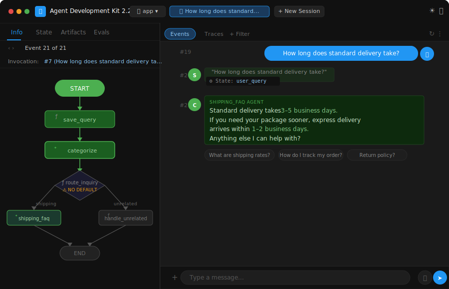

# Day 3 — AI Agents in Practice: Building a Real Customer Support Agent with Google ADK

> **5-Day AI Agents: Intensive Vibe Coding Course With Google × Kaggle**

---

## ✅ What I Did Today

### 🎙️ Listened — Unit 3 Summary Podcast
*"AI Agents in Practice — Building, Evaluating, and Deploying Real Agents"*
→ [Watch on YouTube](https://c.gle/AOPyDKSampFD2FlTtc7Oe8y4ISXPSbtkgSYNIdKZpfCIgozqKCwaA1X8dEbJeO_osDjAGkTdX07KQBu5JzpZwEufbc9fgi6BRhT6Oi6RrO2K1bh1bnKeDmqUfInkvO8KLDf87N_cZDpMVaOILIBfSKp4YGNFIPYELKP6-wpNNpZk-J6mvb82L5tHdmiz_d5dxkCtV7_NoQjQB41D4IjIy8qYW-PrjWqpwW8aemlIptnHXf7YR5SfSZ3ToXQ-qvCo_rU)

### 📄 Read — Whitepaper: AI Agents in Practice
*Building, evaluating, and operating production-grade agents — from design to deployment.*
→ [Read the Whitepaper on Kaggle](https://c.gle/AOPyDKTRLeuNUb9Bkih7NXWsvXSLjNzuP1MiWf_mOC6Mp26WNLpfumY2eK6wSoDsvleSTCQr4OoI8rDkT8XCo34srvvt3nzBQ-2qJVgQuU0-2vDbznFtMGFsHTgyBXTrWTOotLamATAOaLb27E1GNROtg7r3RD3KfgN0Ve03reudpAee5k1tBe3sOdxDuScmrCBrkFXlMn5_RfME135Ck_pnpTClwvWdHpKu819QZOp-l67vIitzOsI6t37WVbLyiTD3j9c)

### 🛠️ Codelabs Completed
- **Build a Customer Support Agent with Google ADK** — Scaffolded and built a real multi-node agent workflow using `agents-cli` and the Google Agent Development Kit
→ [Codelab 1](https://c.gle/AOPyDKQq5Hcob5qyP5hM-gSRWxl560vUOu4OY7ggzpwCA2Afx188mfkj4FRIzLd-y_3-71LvO_To9lrA0mxk0jBji0F3fvPQEAz5Hi8PAm0KAJnE-Gospsec7xuVlDyR5STwnFu3zk9_mSZk3ghOuTw2VDK7ldn9bRkknVi4inkPmR1Ez-PUjccNf1kPhnVDV_DVrobmEJL5HkGhbd7n9Yq6KHFGSYtpjqta19zMicFshsVQQx3kqtCXJBn-In8zLrb29lX1zkiWteGim0-3H6LW-LLoUPTxlfMOIK99nbYYbJ2gp4bAE-BRb_ELVleMt5pIsUoDW3I)
→ [Codelab 2](https://c.gle/AOPyDKRJTTPM7dy2guEC-dVwgDBw_q3yjc7YlBxxP1yOJVVFDwDTXYxzyCXdlp72I-VykAzE1aZcP4JjakFVvUeBcUaqgksDwW_F_l_Cbonak-FpwH9tbDqU3BBaw4-GJGuDWwKofBvg9dW4h9gVZa-KqopBYcWbLvOxA7yx8ZNXa4JmqZ4rde6cQm9ynq-i8ojLG-Yx5reh4Sx7QBouGfMdqbhogvmEJHOYSlISSIwWiNDsvuKDCPeh7zUvzaBHkHfFkodj3qWUIkepSa9D_5AvcHx5PI3vxXInCtvnY8QM)

---

## ⚡ What I Actually Built — Customer Support Agent

A **production-grade AI customer support agent** built with the **Google Agent Development Kit (ADK) 2.2.0** — not a chatbot wrapper, but a real multi-node `Workflow` that classifies user intent, routes intelligently, and answers strictly from a grounded FAQ. Tested live in the **ADK Playground** UI.

### What it does

The agent receives a user message, classifies it as `shipping` or `unrelated` using **Gemini 2.0 Flash** with structured Pydantic output, routes to the correct handler, and either answers from the shipping FAQ or politely declines off-topic queries — all without hallucinating answers outside the FAQ.

**Live test in ADK Playground:**
> User: *"How long does standard delivery take?"*
> Agent: *"Standard delivery takes 3–5 business days. Express delivery takes 1–2 business days."*



The workflow graph (visible in the ADK UI) shows exactly how the query flowed: `START → save_query → categorize → route_inquiry → shipping_faq → END`.

---

## 💡 Key Insight That Hit Hardest

> *"An agent without evaluation is just vibes with an API key. The eval loop — generate traces, grade them, iterate — is what separates a demo from a system you can trust."*

The `AGENTS.md` file scaffolded by `agents-cli` frames the entire development cycle in phases: build → eval loop → test → deploy. What hit hardest is that the **eval loop is the main phase** — not an afterthought. You're expected to run `agents-cli eval generate` and `agents-cli eval grade` 5–10+ times before even thinking about deployment. That's a fundamentally different mindset from shipping code and hoping it works.

---

## 🧠 Key Learnings

### 1. `google.adk.workflow.Workflow` is a real orchestration primitive
This isn't an agent that "does things in sequence" — it's a DAG. Each `node` in the workflow is independently runnable, stateful via `EventActions(state_delta=...)`, and can yield multiple `Event` objects. The `route_inquiry` node reads classified state and emits a `route=` action that the framework uses to branch — exactly like a router in a backend system.

### 2. Structured output is the key to reliable routing
`categorize_agent` uses a Pydantic `InquiryCategory` schema with `Literal["shipping", "unrelated"]` — not free-form text. Gemini returns a structured JSON object matching the schema, which `route_inquiry` reads deterministically. No string matching, no regex, no guessing — the type system enforces the contract.

### 3. `agents-cli` is more than a scaffolder — it's an ops platform
The `AGENTS.md` reveals commands most people never use: `agents-cli eval analyze` (cluster failure modes), `agents-cli eval compare` (regression diffs between runs), `agents-cli eval optimize` (auto-tune prompts using eval data). The scaffold is the beginning of the ops surface, not the end.

### 4. Grounding an agent to a FAQ is the right starting pattern
`shipping_faq` agent has the instruction: *"Answer based ONLY on the shipping FAQ below. Do not answer questions outside of the FAQ."* This constraint — baked into the system prompt — is the simplest form of agent safety. Before reaching for RAG or vector search, hardcoded grounding on a small knowledge base is often enough and always faster to debug.

### 5. The ADK Playground is a production debugging tool, not just a demo
The Playground exposes Events, Traces, State, and Artifacts in real time. You can inspect exactly what state was saved after `save_query`, what the model returned from `categorize`, what route was taken, and what the final output was — per invocation, per event. This is the observability layer built in by default.

---

## 📁 File Structure & Explanations

```
day3/
├── README.md                        ← This file — learnings and project overview
└── src/
    ├── pyproject.toml               ← Project deps: google-adk[gcp]>=2.0, FastAPI, OpenTelemetry
    ├── Dockerfile                   ← Container image: python:3.12-slim + uv + uvicorn on port 8080
    ├── agents-cli-manifest.yaml     ← agents-cli project config (version, region, session type)
    ├── AGENTS.md                    ← Coding agent guide: phases, commands, operational rules
    ├── .env.example                 ← Auth template: GEMINI_API_KEY or Vertex AI ADC
    ├── app/
    │   ├── agent.py                 ← All agent logic: workflow, nodes, LlmAgents, routing
    │   ├── fast_api_app.py          ← FastAPI server wrapper (served via uvicorn)
    │   └── app_utils/
    │       ├── telemetry.py         ← OpenTelemetry setup → Cloud Trace + BigQuery + Logging
    │       └── typing.py            ← Shared type helpers
    └── tests/
        ├── unit/test_dummy.py       ← Unit test placeholder
        ├── integration/
        │   ├── test_agent.py        ← Integration test: runs agent with "Why is the sky blue?"
        │   └── test_server_e2e.py   ← End-to-end server test
        └── eval/
            ├── eval_config.yaml     ← Eval metrics and grader config
            └── datasets/
                └── basic-dataset.json ← Eval cases: greeting + weather query (unrelated test)
```

### Component Roles

| File | Purpose |
|------|---------|
| `app/agent.py` | The entire agent. Defines `InquiryCategory` Pydantic schema, `save_query` node, `categorize_agent` (LlmAgent with structured output), `route_inquiry` node (conditional branching), `shipping_faq` agent (grounded to FAQ), `handle_unrelated` node (deterministic decline). Assembled into a `Workflow` DAG and wrapped in an `App`. |
| `app/fast_api_app.py` | FastAPI wrapper that exposes the ADK `App` as an HTTP service. Entry point for `uvicorn` in the Docker container. |
| `app/app_utils/telemetry.py` | Bootstraps OpenTelemetry tracing. Exports spans to Google Cloud Trace, logs to Cloud Logging, and events to BigQuery — all built-in observability with zero config in Cloud Run. |
| `pyproject.toml` | Managed by `uv`. Core dep: `google-adk[gcp]>=2.0.0`. Dev: pytest + pytest-asyncio. Eval: `google-adk[eval]` + Vertex AI evaluation SDK. Lint: ruff + ty + codespell. |
| `Dockerfile` | `python:3.12-slim` base, installs `uv`, copies `app/` and `pyproject.toml`, runs `uv sync --frozen`, exposes port 8080, starts uvicorn. One-command deploy via `agents-cli deploy`. |
| `tests/eval/datasets/basic-dataset.json` | Two eval cases: a greeting (tests graceful handling) and a weather query (tests the `unrelated` route). Run with `agents-cli eval generate` then `agents-cli eval grade`. |

---

## 🗂️ Workflow Architecture

```
User message
     │
     ▼
  save_query          ← saves raw text to session state (user_query)
     │
     ▼
  categorize          ← Gemini 2.0 Flash → Pydantic structured output
  (LlmAgent)           InquiryCategory { category: "shipping" | "unrelated" }
     │
     ▼
  route_inquiry       ← reads ctx.state["inquiry_category"], emits route=
  (@node)
     │
     ├── "shipping"  ──► shipping_faq     ← answers from hardcoded FAQ only
     │                   (LlmAgent)
     │
     └── "unrelated" ──► handle_unrelated ← deterministic polite decline
                         (@node, no LLM)
```

---

## 🚀 How to Run Locally

**Prerequisites:** Python 3.11+, [uv](https://docs.astral.sh/uv/), a free [Gemini API key](https://aistudio.google.com/apikey)

```bash
# 1. Navigate to the project
cd day3/src

# 2. Copy env template and add your key
cp .env.example .env
# Edit .env → set GEMINI_API_KEY=your_key_here

# 3. Install agents-cli (one-time)
uvx google-agents-cli setup

# 4. Install project dependencies
agents-cli install

# 5. Launch the ADK Playground
agents-cli playground
# Opens http://localhost:8000 — the full ADK UI with workflow graph, events, traces
```

**Try these queries in the Playground:**
- `"How long does standard delivery take?"` → routes to `shipping_faq`
- `"What is the capital of France?"` → routes to `handle_unrelated`
- `"How much does express shipping cost?"` → routes to `shipping_faq`

**Run tests:**
```bash
uv run pytest tests/unit tests/integration
```

**Run eval:**
```bash
agents-cli eval generate
agents-cli eval grade
```

---

## 🔗 Resources

| Resource | Link |
|----------|------|
| 🎙️ Unit 3 Podcast | [YouTube](https://c.gle/AOPyDKSampFD2FlTtc7Oe8y4ISXPSbtkgSYNIdKZpfCIgozqKCwaA1X8dEbJeO_osDjAGkTdX07KQBu5JzpZwEufbc9fgi6BRhT6Oi6RrO2K1bh1bnKeDmqUfInkvO8KLDf87N_cZDpMVaOILIBfSKp4YGNFIPYELKP6-wpNNpZk-J6mvb82L5tHdmiz_d5dxkCtV7_NoQjQB41D4IjIy8qYW-PrjWqpwW8aemlIptnHXf7YR5SfSZ3ToXQ-qvCo_rU) |
| 📄 AI Agents in Practice Whitepaper | [Kaggle](https://c.gle/AOPyDKTRLeuNUb9Bkih7NXWsvXSLjNzuP1MiWf_mOC6Mp26WNLpfumY2eK6wSoDsvleSTCQr4OoI8rDkT8XCo34srvvt3nzBQ-2qJVgQuU0-2vDbznFtMGFsHTgyBXTrWTOotLamATAOaLb27E1GNROtg7r3RD3KfgN0Ve03reudpAee5k1tBe3sOdxDuScmrCBrkFXlMn5_RfME135Ck_pnpTClwvWdHpKu819QZOp-l67vIitzOsI6t37WVbLyiTD3j9c) |
| 🛠️ Codelab 1 | [Google Codelabs](https://c.gle/AOPyDKQq5Hcob5qyP5hM-gSRWxl560vUOu4OY7ggzpwCA2Afx188mfkj4FRIzLd-y_3-71LvO_To9lrA0mxk0jBji0F3fvPQEAz5Hi8PAm0KAJnE-Gospsec7xuVlDyR5STwnFu3zk9_mSZk3ghOuTw2VDK7ldn9bRkknVi4inkPmR1Ez-PUjccNf1kPhnVDV_DVrobmEJL5HkGhbd7n9Yq6KHFGSYtpjqta19zMicFshsVQQx3kqtCXJBn-In8zLrb29lX1zkiWteGim0-3H6LW-LLoUPTxlfMOIK99nbYYbJ2gp4bAE-BRb_ELVleMt5pIsUoDW3I) |
| 🛠️ Codelab 2 | [Google Codelabs](https://c.gle/AOPyDKRJTTPM7dy2guEC-dVwgDBw_q3yjc7YlBxxP1yOJVVFDwDTXYxzyCXdlp72I-VykAzE1aZcP4JjakFVvUeBcUaqgksDwW_F_l_Cbonak-FpwH9tbDqU3BBaw4-GJGuDWwKofBvg9dW4h9gVZa-KqopBYcWbLvOxA7yx8ZNXa4JmqZ4rde6cQm9ynq-i8ojLG-Yx5reh4Sx7QBouGfMdqbhogvmEJHOYSlISSIwWiNDsvuKDCPeh7zUvzaBHkHfFkodj3qWUIkepSa9D_5AvcHx5PI3vxXInCtvnY8QM) |
| 🤖 Google ADK | [adk.dev](https://adk.dev) |
| ☁️ Google Cloud Run | [cloud.google.com/run](https://cloud.google.com/run) |

---

*Part of the [5-Day AI Agents Intensive](../README.md) — Day 3 of 5*
