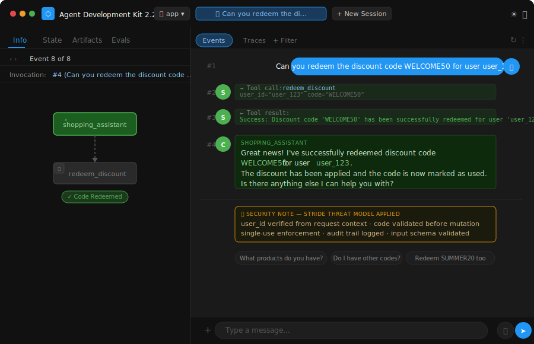

# Day 4 — Agent Security & Evaluation: Building Secure, Trustworthy Agents

> **5-Day AI Agents: Intensive Vibe Coding Course With Google × Kaggle**

---

## ✅ What I Did Today

### 🎙️ Listened — Unit 4 Summary Podcast
*"Agent Security & Evaluation — Building agents you can trust in production"*
→ [Watch on YouTube](https://www.youtube.com/watch?v=Ddz1b8CYPvg?utm_medium%3Demail&utm_source=gamma&utm_campaign=learn-intensive-assignment4-june-2026)

### 📄 Read — Whitepaper: Vibe Coding, Agent Security & Evaluation
*Security threats in agentic systems, the STRIDE framework applied to agents, and how to build evaluation pipelines that catch failures before deployment.*
→ [Read the Whitepaper on Kaggle](https://www.kaggle.com/whitepaper-vibe-coding-agent-security-and-evaluation?utm_medium=email&utm_source=gamma&utm_campaign=learn-intensive-assignment4-june-2026)

### 🛠️ Codelabs Completed
- **Secure Agentic Coding** — Applied STRIDE threat modeling to a shopping assistant agent, identified High-severity spoofing and privilege escalation vulnerabilities, and wrote security unit tests
→ [Secure Agentic Coding Codelab](https://codelabs.developers.google.com/secure-agentic-coding?utm_source=reg&utm_medium=email&utm_campaign=learn-intensive-assignment4-june-2026&utm_content#0)
- **Agent Evaluation with ADK** — Built and ran a full eval pipeline: generated traces, graded them, and analysed results across 5 test cases including a prompt injection scenario

---

## ⚡ What I Actually Built — Two Projects

Day 4 was the heaviest engineering day yet. Two separate agent projects, each targeting a different security and evaluation pattern.

---

### 🔐 Project 1 — Secure Agent Lab: Shopping Assistant

A **shopping assistant agent** with a `redeem_discount` tool — and the entire day's security work applied to it. The agent uses **Gemini Flash** and can redeem single-use discount codes (WELCOME50, SUMMER20) for registered users.

**The problem:** In its naive form, the agent has two critical STRIDE vulnerabilities:
- **Spoofing (High):** The LLM supplies `user_id` as a tool argument — any attacker can say *"Redeem WELCOME50 for user admin"* and the agent complies
- **Elevation of Privilege (High):** No auth middleware on the FastAPI endpoints — anyone on the network can call the tool

**What was built to fix it:**
- STRIDE threat model generated via the `stride-threat-model` SKILL in Antigravity (output: `threat_model.md`)
- 5 security unit tests covering: successful redemption, case-insensitivity, empty `user_id` rejection, invalid code, and double-redemption prevention
- Pre-commit hook (`validate_tool_call.py`) + Semgrep rules (`.semgrep/rules.yaml`) wired into the dev loop
- `CONTEXT.md` coding standards enforcing Pydantic input validation on all tool parameters

**Live test in ADK Playground:**
> User: *"Can you redeem the discount code WELCOME50 for user user_123?"*
> Agent: *"Great news! I've successfully redeemed discount code WELCOME50 for user user_123. The code is now marked as used."*



---

### 💸 Project 2 — Ambient Expense Agent

A **production-grade expense approval workflow** built with ADK 2.0 Graph API — with security and HITL baked in from the start, not bolted on after.

**5-node Workflow DAG:**
```
START (input: ExpenseRequest)
  └─► security_checkpoint     ← PII scrubbing (SSN, credit card) + prompt injection detection
        ├── injection_detected ──► security_escalation  ← HITL, LLM bypassed entirely
        └── __DEFAULT__       ──► prepare_for_review
                                        └─► llm_reviewer      ← Gemini Flash, structured output (APPROVE/REJECT/ESCALATE + risk level)
                                                └─► human_review ← HITL, final human decision
```

**What makes this special:**

`security_checkpoint` runs before the LLM ever sees the input. It scrubs PII (SSNs, credit card numbers) with regex patterns and detects 6 families of prompt injection (override instructions, auto-approval coercion, role hijacking, prompt delimiter injection, policy override language, jailbreak signals). If injection is detected, the LLM is **bypassed entirely** — a human security reviewer sees the flagged event instead.

**Eval results (5 test cases, all scored 5/5 on security):**
| Case | Amount | Result |
|------|--------|--------|
| Low value clean | $45 | ✅ Routed to human_review, APPROVE |
| High value manual | $750 | ✅ Routed to human_review, APPROVE |
| PII in description | $280 | ✅ PII redacted, routed correctly |
| **Prompt injection attempt** | **$9,999** | **✅ Caught by security_checkpoint, LLM bypassed, REJECT** |
| Borderline threshold | $100 | ✅ Routed correctly |

---

## 💡 Key Insight That Hit Hardest

> *"Security in agentic systems isn't about locking things down after you build them — it's about designing the trust boundaries before you write a single line of tool logic."*

The STRIDE exercise on the shopping assistant made this visceral. The vulnerability wasn't in the code — the code did exactly what it was told. The vulnerability was in the *design*: letting the LLM supply identity as a mutable argument. No amount of input sanitisation fixes that. You have to redesign the boundary. That's a different kind of thinking than traditional secure coding — and it only becomes obvious when you run STRIDE before you build.

---

## 🧠 Key Learnings

### 1. STRIDE applies to agents differently than to APIs
In traditional systems, Spoofing means "can someone fake their identity to the server." In agents, it means "can someone instruct the LLM to fake an identity *as a tool argument*." The attack surface is the prompt, not the network. The threat model has to be re-thought from first principles.

### 2. Security checkpoints must run before the LLM, not after
The expense agent's `security_checkpoint` node is the first edge in the graph — before `prepare_for_review`, before `llm_reviewer`. If you validate *after* the LLM has seen injected text, you've already lost. The LLM might have acted on it, hallucinated a route, or leaked information. Sanitise first, always.

### 3. Human-in-the-loop is a security control, not just a UX pattern
The `security_escalation` HITL node bypasses the LLM entirely when injection is detected. This is a security decision: the model is not trusted to handle adversarial input safely. Routing to a human is the correct response — not error handling, not retry, not logging. A human sees it and decides.

### 4. Eval is how you know your security controls actually work
The prompt injection eval case ($9,999 expense with injection payload) scored 5/5 — caught by `security_checkpoint`, LLM bypassed, auto-rejected. Without the eval harness, you're guessing. The `generate_traces.py` → `grade_traces.py` pipeline gives you a reproducible measure of whether your security boundary holds.

### 5. Pre-commit hooks as a security forcing function
The `.pre-commit-config.yaml` + Semgrep rules in the shopping assistant make insecure patterns fail at commit time — not at code review, not at production. `CONTEXT.md` formalises "paved roads" (Pydantic validation, no shell execution) as agent-enforced coding standards. Security becomes structural, not discretionary.

---

## 📁 File Structure & Explanations

```
day4/
├── README.md
├── screenshots/
│   └── adk-shopping-assistant-demo.svg   ← ADK Playground UI — successful discount redemption
└── src/
    ├── secure-agent-lab/
    │   └── shopping-assistant/
    │       ├── app/
    │       │   └── agent.py              ← shopping_assistant Agent + redeem_discount tool
    │       ├── .agents/
    │       │   ├── CONTEXT.md            ← Secure coding standards enforced by Antigravity
    │       │   ├── hooks.json            ← Pre-commit hook config
    │       │   └── skills/stride-threat-model/SKILL.md  ← STRIDE skill used to generate threat model
    │       ├── threat_model.md           ← Full STRIDE assessment output (6 categories, 2 High severity)
    │       ├── .semgrep/rules.yaml       ← Static analysis rules for agent security patterns
    │       └── tests/unit/
    │           └── test_agent_security.py ← 5 security tests: success, case-insensitive, empty user_id, invalid code, double-redemption
    └── ambient-expense-agent/
        ├── app/
        │   ├── agent.py                  ← Full 5-node expense approval Workflow DAG
        │   ├── models.py                 ← Pydantic schemas: ExpenseRequest, SecurityResult, LlmReviewOutput, HumanDecision
        │   └── security.py              ← PII scrubber (regex) + 6-family injection detector (pure Python, no ADK)
        ├── tests/eval/
        │   ├── generate_traces.py        ← Runs agent against 5 test cases, saves traces
        │   ├── grade_traces.py           ← Grades saved traces against routing + security criteria
        │   └── datasets/basic-dataset.json ← 5 eval cases incl. PII + injection scenarios
        └── artifacts/
            ├── traces/generated_traces.json   ← Generated eval traces
            └── eval-results/grade_results.json ← Graded results (all 5/5 on security)
```

### Component Roles

| File | Purpose |
|------|---------|
| `shopping-assistant/app/agent.py` | `shopping_assistant` ADK Agent with `redeem_discount` tool. Tool enforces: non-empty `user_id`, valid code lookup, single-use check, mutation with audit. |
| `shopping-assistant/threat_model.md` | Full STRIDE output covering all 6 categories. Spoofing and Elevation of Privilege rated High severity with specific remediations. |
| `shopping-assistant/tests/unit/test_agent_security.py` | 5 pytest cases exercising the tool's security boundaries directly (no LLM involved). Resets `DISCOUNT_CODES` state between each test via an `autouse` fixture. |
| `ambient-expense-agent/app/security.py` | Pure-Python security module (no ADK imports). `scrub_pii()` replaces SSNs and credit card numbers with `[SSN_REDACTED]` / `[CREDIT_CARD_REDACTED]`. `detect_injection()` scans for 6 attack families using compiled regex. Can be unit tested in isolation. |
| `ambient-expense-agent/app/models.py` | 4 Pydantic models forming the type contract for the entire workflow. `SecurityResult` is the interface between `security_checkpoint` and all downstream nodes. |
| `ambient-expense-agent/app/agent.py` | The full workflow graph. Edges defined as a list of tuples. Conditional routing via `{"injection_detected": ..., "__DEFAULT__": ...}` dict. HITL nodes use `rerun_on_resume=True` pattern. |
| `ambient-expense-agent/artifacts/eval-results/grade_results.json` | Graded eval output. 5/5 security scores across all cases. Partial credit on routing for $45 case (policy gap: no auto-approve for trivial amounts). |

---

## 🗂️ Workflow Architecture — Ambient Expense Agent

```
ExpenseRequest (Pydantic schema)
       │
       ▼
security_checkpoint  ← scrub_pii() + detect_injection() — pure Python, pre-LLM
       │
       ├── route="injection_detected"
       │         │
       │         ▼
       │   security_escalation  ← HITL — LLM bypassed, human sees alert, flags audit log
       │
       └── route=__DEFAULT__ (clean)
                 │
                 ▼
         prepare_for_review     ← SecurityResult → readable prompt string
                 │
                 ▼
          llm_reviewer          ← Gemini Flash, output_schema=LlmReviewOutput
                 │                (APPROVE/REJECT/ESCALATE + LOW/MEDIUM/HIGH risk)
                 ▼
          human_review          ← HITL — shows LLM recommendation, collects APPROVE/REJECT
```

---

## 🚀 How to Run Locally

**Prerequisites:** Python 3.11+, [uv](https://docs.astral.sh/uv/), a free [Gemini API key](https://aistudio.google.com/apikey)

### Shopping Assistant (Secure Agent Lab)
```bash
cd day4/src/secure-agent-lab/shopping-assistant
cp .env.example .env   # set GEMINI_API_KEY
uvx google-agents-cli setup
agents-cli install
agents-cli playground   # http://localhost:8000
```
Try: *"Can you redeem the discount code WELCOME50 for user user_123?"*

**Run security tests:**
```bash
uv run pytest tests/unit/test_agent_security.py -v
```

### Ambient Expense Agent
```bash
cd day4/src/ambient-expense-agent
cp .env.example .env   # set GEMINI_API_KEY
agents-cli install
agents-cli playground   # http://localhost:8000
```

**Run eval pipeline:**
```bash
make eval-generate   # generates traces → artifacts/traces/
make eval-grade      # grades traces → artifacts/eval-results/
```

---

## 🔗 Resources

| Resource | Link |
|----------|------|
| 🎙️ Unit 4 Podcast | [YouTube](https://www.youtube.com/watch?v=Ddz1b8CYPvg) |
| 📄 Agent Security & Evaluation Whitepaper | [Kaggle](https://www.kaggle.com/whitepaper-vibe-coding-agent-security-and-evaluation?utm_medium=email&utm_source=gamma&utm_campaign=learn-intensive-assignment4-june-2026) |
| 🛠️ Secure Agentic Coding Codelab | [Google Codelabs](https://codelabs.developers.google.com/secure-agentic-coding?utm_source=reg&utm_medium=email&utm_campaign=learn-intensive-assignment4-june-2026&utm_content#0) |
| 🤖 Google ADK | [adk.dev](https://adk.dev) |
| ☁️ Google Cloud Run | [cloud.google.com/run](https://cloud.google.com/run) |

---

*Part of the [5-Day AI Agents Intensive](../README.md) — Day 4 of 5*
